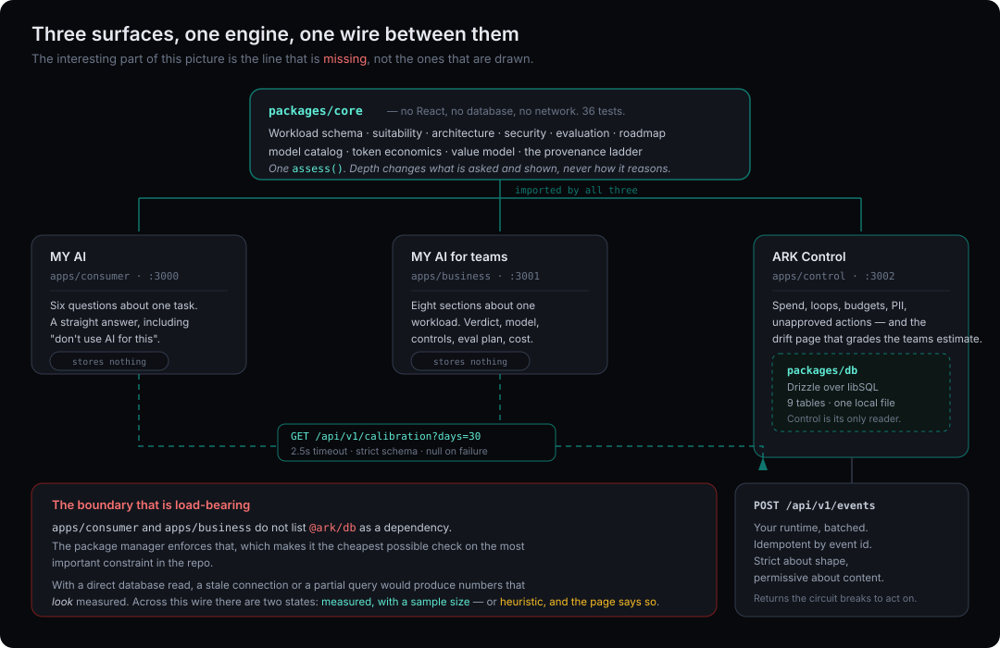

# Architecture

## The shape



## The one boundary that is load-bearing

`apps/consumer` and `apps/business` do not list `@ark/db` as a dependency. This is checked by the package manager, which makes it the cheapest possible enforcement of the most important architectural constraint in the repo.

The consequence is that AIFit can only reach Control through one documented HTTP call:

```ts
const calibration = await fetchCalibration({ days: 30 });
const assessment = assess(workload, { depth: 'business', calibration });
```

`fetchCalibration` returns `CalibrationSet | null`. It returns `null` on: no `ARK_CONTROL_URL` set, a 2.5s timeout, any non-200, or a response that fails schema validation. It never throws and it never partially applies.

This matters because the failure mode it prevents is the dangerous one. If AIFit could reach the database directly, a partial read or a stale connection would silently produce numbers that *look* measured. Across an HTTP boundary with a strict schema and a null return, the only two states are "measured, with a sample size" and "heuristic, and the page says so."

## Data flow, end to end

1. **Runtime emits.** A workload in production POSTs to `/api/v1/events` — one row per model call, tagged with a trace id, a turn index, model, provider, token counts, latency, and an outcome when the trace closes.
2. **Control prices and rolls up.** Each event is priced against the model catalog. Unpriceable events (unknown model, off-allowlist provider) are accepted, flagged, and counted — never dropped, because the traffic happened whether or not the catalog knows about it.
3. **Control detects.** Turn ceiling breached → `loop_runaway`. Trace cost ceiling breached → `circuit_break`. Provider outside the allowlist → `off_allowlist`. Prompt sample matching a sensitive-data detector → `sensitive_data`. Model price past its `asOf` window → `stale_pricing`.
4. **Control computes priors.** Per architecture pattern, over a rolling window: turns per outcome, context growth per turn, failure rate, retries per failure, cache hit rate, cost per outcome, p95 turns, sample size.
5. **AIFit consumes.** `GET /api/v1/calibration?days=30` returns those priors with `basis: "measured"`. Patterns below the 30-trace floor are returned but marked, and `resolveCallShape` declines to use them.
6. **Control closes the loop.** `/workloads/[id]` compares what AIFit predicted against what the workload actually costs and renders the drift as a percentage. This is the page that keeps the rubric honest, and it is the reason the estimate has a name and a date attached to it.

## The turn index

One design decision does most of the work in step 4 above: events carry a `turn` index within a trace. It is what makes `MAX(total_turns)` per trace a runaway-loop detector, p95 turns an operational signal, and `turnsPerOutcome` a thing that can be computed at all. The argument for it, drawn against the alternative, is in [Data model § The distinction the whole system rests on](03-data-model.md#the-distinction-the-whole-system-rests-on).

## Sensitive data handling in ingest

The ingest endpoint accepts an optional `sample` field — a prompt excerpt — so it can detect PII, credentials, and payment data reaching a model provider. It scans the sample and then discards it. The alert records what class of thing was found and in which workload; it does not record the value.

A control that logs the PII it found in order to warn you about PII is not a control.

## Why SQLite first

The entire system runs on a local file with no services, no containers, and no cloud account. `npm run setup && npm run dev` produces a working three-app system with seeded telemetry in under a minute.

The schema is Drizzle over `@libsql/client`, which speaks the same protocol to a local file, to Turso, and — with a driver swap — to Postgres. Nothing in the query layer assumes single-writer semantics. See [ADR-0004](adr/0004-sqlite-first.md).

## Rendering strategy

All three apps are Next.js App Router. Assessment pages are `force-dynamic` server components: the intake is decoded, calibration is fetched, the engine runs, and HTML is returned. Nothing about an assessment is cached, because a cached assessment could outlive the calibration data it was computed from and would then be a `measured` label on a stale measurement.

The calibration endpoint itself is cached (`max-age=60, stale-while-revalidate=300`) because it is an aggregate over a 30-day window and a minute of staleness in that is meaningless.

Client components are confined to the two intake forms. Everything else — every report, every dashboard — is server-rendered, which is why a report page ships 162 bytes of page-specific JavaScript.

## Shared UI

`packages/ui` carries the component vocabulary and a Tailwind preset. It deliberately contains **no form controls**. The three surfaces disagree about how much to ask and how to ask it, and that disagreement should live in the apps rather than leaking into a shared package as a growing pile of variant props.

What it does carry is `BasisTag`, which is the single most important component in the system. Centralising it means the provenance ladder is rendered identically everywhere and cannot be quietly omitted from one surface during a redesign.
