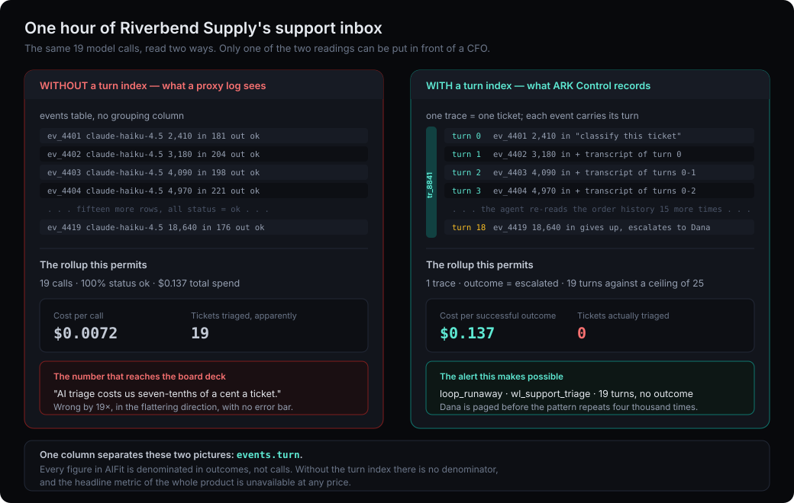

# Data model

Nine tables. The shape of this schema is an argument about what an AI workload actually is, so it is worth reading before the SQL.

## The distinction the whole system rests on

**A trace is one unit of business work.** One ticket triaged. One refund processed. One document summarised. It is the thing the business counts and the thing the business pays for.

**An event is one model call.** A trace may contain one event or nineteen.

Every other telemetry product in this category logs events and calls it a day. That is the flaw. With events alone, an agent that loops nineteen times to close one ticket is indistinguishable from nineteen tickets closed on the first try. The first is an incident; the second is a good day. Both produce nineteen rows.

Cost per outcome — the headline number in every MY AI for teams report — is `SUM(events.cost) / COUNT(DISTINCT traces)`. Without the trace, the denominator is wrong, and it is wrong in the flattering direction, which is the direction nobody checks.



## Tables

| Table | Grain | Why it exists |
|---|---|---|
| `orgs` | One per tenant | Scoping. Everything else carries `orgId`. |
| `workloads` | One per assessed workload | The join between a MY AI for teams estimate and the running system it described. |
| `traces` | One per unit of business work | The denominator of every cost figure. |
| `events` | One per model call | The raw priced fact. |
| `actions` | One per side effect | What the model *did*, as distinct from what it said. |
| `budgets` | One per scope + period | The ceiling, and what happens at it. |
| `alerts` | One per detection | Nine kinds, listed below. |
| `qualitySamples` | One per judged output | The only source of an accuracy number that is not a guess. |
| `calibrationSnapshots` | One per computation | Versioned history of the priors. |

### `workloads`

Carries `spec` (the `Workload` object MY AI for teams was given) and `assessment` (what MY AI for teams returned), both as JSON, alongside the resolved `pattern` and a lifecycle `status`:

```
proposed → shadow → assisted → live → retired
```

Storing both halves is what makes `/workloads/[id]` possible. That page renders predicted cost against observed cost as a drift percentage. It is the only page in the system whose purpose is to embarrass the rest of the system, and it is the reason the estimate has a name and a date attached to it rather than being an anonymous number that nobody has to own.

`shadow` is a real status and not decoration. A workload running in shadow emits traces and costs money but takes no actions, which is the only honest way to measure turns per outcome before committing to the pattern.

### `traces`

Carries an `outcome` enum and three denormalised rollups: `totalCostUsd`, `totalTurns`, `retries`, plus `escalatedToHuman`.

Denormalising is a deliberate trade. The values are derivable from `events`, but the dashboard queries them per row on every page load, and an aggregate over events is the query that gets slow first. They are written when the trace closes and they are never the source of truth — a rebuild job can recompute them from `events` at any time. If the two ever disagree, `events` wins.

`escalatedToHuman` is the flag that keeps `displacementFactor` honest. A workload that escalates 40% of traces is not displacing 100% of the human work, whatever the ROI model was told.

### `events`

The priced fact. Per call: `turn`, model, provider, `inputTokens`, `outputTokens`, `cachedInputTokens`, `costUsd`, `latencyMs`, a status enum, `sensitiveMatches` JSON, and `offAllowlist`.

Three notes:

**`turn` is the load-bearing column.** `MAX(turn)` per trace surfaces runaway loops. p95 of that becomes a real operational signal. And `turnsPerOutcome` — the single variable that most distorts cost forecasts — has something to be computed from.

**`cachedInputTokens` is separate from `inputTokens`** because cached reads bill at roughly 10% of the input rate across the major providers. Folding them together overstates cost by a margin that grows exactly as the system gets better at caching, which would mean the reward for optimising is a worse-looking bill.

**Unpriceable events are stored, flagged, and counted — never dropped.** An event naming a model the catalog has never heard of still happened, still cost money, and is a signal in its own right: either someone changed models without telling anyone, or the catalog is stale. Dropping it would make the bill look smaller and the system look cleaner. Both would be lies.

### `actions`

Actions are separated from events because an action is not a model call, it is a consequence. One event can produce several, and the risk attached to them has nothing to do with token count.

Each row carries a `blastRadius` and a nullable `approvedBy`.

**`approvedBy` is nullable on purpose.** A schema that required it could not represent the thing worth detecting. An irreversible action with a null approver is SEC-05 firing — the system did something it could not undo and no human signed for it. Making the column `NOT NULL` would have made that state unrepresentable in the data and therefore invisible in the product, which is a very tidy way of not finding out.

### `budgets`

Scope, period, `limitUsd`, `warnAtPct`, and an `enforcement` mode:

```
observe → warn → throttle → block
```

Four modes rather than a boolean because a budget that can only do nothing or kill traffic will be set to "do nothing" by anyone who has been paged at 3am. `observe` is the honest default for a workload nobody has measured yet.

### `alerts`

Nine kinds: `loop_runaway`, `circuit_break`, `off_allowlist`, `sensitive_data`, `stale_pricing`, `budget_warn`, `budget_breach`, `unapproved_action`, `quality_regression`.

They split cleanly into three groups — cost (`loop_runaway`, `circuit_break`, `budget_*`), correctness (`quality_regression`, `stale_pricing`), and safety (`off_allowlist`, `sensitive_data`, `unapproved_action`). Every security control the business report emits with `blocking: true` maps to one of these, which is what lets the `verifiedBy` column say something specific instead of "monitor this".

A `sensitive_data` alert records the *class* of thing found and the workload it was found in. It does not record the value, and there is no column it could be written to. The reasoning is in [Architecture § Sensitive data handling in ingest](01-architecture.md#sensitive-data-handling-in-ingest).

### `qualitySamples`

`correct` (boolean) and `judgedBy` (`human` | `eval` | `heuristic`).

`judgedBy` is the provenance ladder applied to accuracy. A 93% figure derived from an LLM-as-judge and a 93% figure derived from human review are not the same claim, and a table that cannot tell them apart will eventually be used to defend a launch.

### `calibrationSnapshots`

Versioned, never overwritten.

The priors change as traffic changes. If each computation replaced the last, then when a forecast turns out wrong there would be no way to establish what the system believed at the time it was made — and "the model was right given what it knew" versus "the model was wrong" is the entire distinction between a calibration bug and a data bug. Keeping the history costs a few kilobytes a month.

## What the ingest endpoint accepts

`POST /api/v1/events` takes a batch. Each row is an event with its trace id and turn index. A trace closes when a row arrives with an outcome.

The endpoint is deliberately permissive about content and strict about shape: unknown models, off-allowlist providers, and unpriceable combinations are all accepted and flagged, while a malformed row is rejected outright. Telemetry that rejects real traffic because the catalog is behind is telemetry that under-reports exactly when something unusual is happening.

## Portability

No SQLite-specific column type appears anywhere above. That is a constraint on this file rather than a coincidence: timestamps are integers and JSON columns are text so that the move to Turso is a URL change and the move to Postgres is a driver swap. The four conditions that would trigger either move are enumerated in [ADR-0004](adr/0004-sqlite-first.md).
